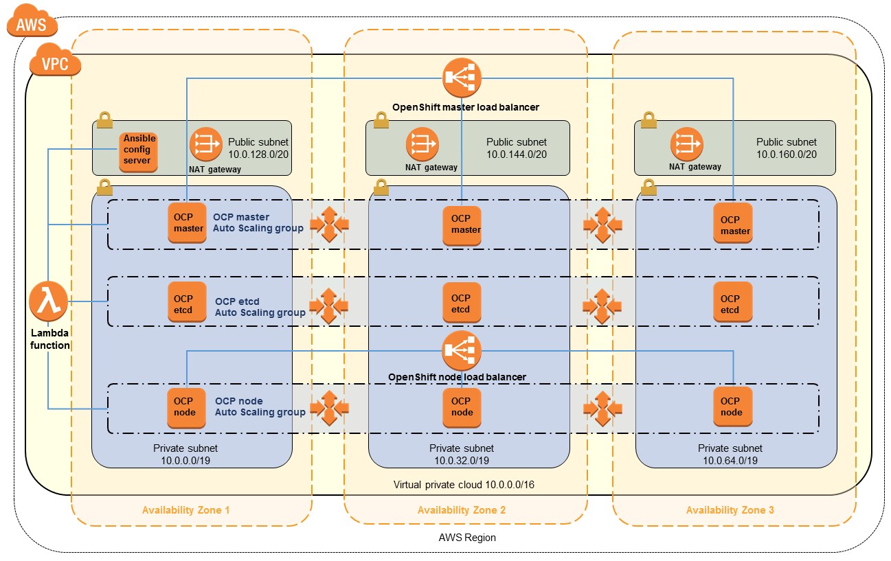

# Red Hat OpenShift Container Platform v3 on AWS China

这里提供快捷部署在AWS中国区域快速部署Red Hat OpenShift的方式。 部署的集群如下图。



### 需要准备的资源 
1. AWS中国区域的帐号
2. Red Hat Enterprise Linux的Subscription，需要包含OCP。 
3. 已备案的域名

### 建立VPC网络环境

您可以使用现有VPC，或者新建VPC. 需要包含3个公有子网，3个私有子网, Internet Gateway和NAT Gateway。 私有子网可通过NAT Gateway访问internet。VPC需要打开DNS Hostname.

### 准备本地Yum Repo和Docker镜像

为了避免跨境网络不稳定导致安装失败，建议先做好Yum Repo和Redhat Docker registry的本地镜像。 详细步骤参见[OpenShift文档](https://docs.openshift.com/container-platform/3.10/install/disconnected_install.html)。

由于QuickStart包括对Glusterfs的支持，需要下载两个额外的repo:

- rhel-7-fast-datapath-rpms
- rh-gluster-3-client-for-rhel-7-server-rpms

```bash
subscription-manager repos --enable="rhel-7-server-rpms" \
    --enable="rhel-7-server-extras-rpms" \
    --enable="rhel-7-server-ose-3.10-rpms" \
    --enable="rhel-7-fast-datapath-rpms" \
    --enable="rhel-7-server-ansible-2.4-rpms" \
    --enable="rh-gluster-3-client-for-rhel-7-server-rpms"
```

### 使用CloudFormation模板部署OpenShift

您可以使用CloudFormation便捷的部署这个集群。

AWS Region   | YAML Format
------------ | ------------
宁夏区域 | [](https://console.amazonaws.cn/cloudformation/home?region=cn-northwest-1#/stacks/new?stackName=OpenShift&amp;templateURL=https://aws-quickstart-cn.s3.cn-northwest-1.amazonaws.com.cn/quickstart-redhat-openshift/templates/openshift.template)
